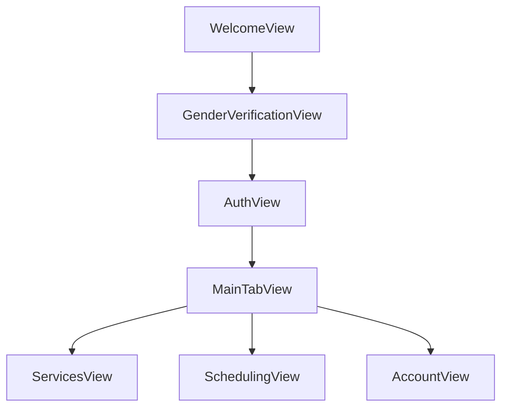

# Service Showcase & Client Scheduler - SwiftUI Demo App


**Service Showcase & Client Scheduler** is a SwiftUI demo application showcasing a professional appointment booking app for esthetician services. This app demonstrates a full-featured iOS experience, including user authentication, service browsing, scheduling, and account management.

---

## Table of Contents

- [Features](#Features)
- [App Flow](#App-Flow)
- [Architecture & Code Highlights](#Architecture-&-Code-Highlights)
- [Getting Started](#Getting-Started)
- [Folder Structure](#Folder-Structure)

---

## Features

- **Authentication Flow**
  - Login and Sign Up
  - Gender verification (app is designed for female clients)
- **Service Listings**
  - Browse available services with pricing and duration
  - Detailed service description
- **Appointment Booking**
  - Select service and preferred date/time
  - View upcoming appointments
- **Account Management**
  - View user info
  - Logout functionality
- **Demo-only Backend**
  - Mocked authentication and appointment data

---

## App Flow



---

## Architecture & Code Highlights

- State Management: Uses @EnvironmentObject and @Published for global app state.
- SwiftUI Navigation: Uses NavigationStack for deep linking between onboarding, booking, and account views.
- Reusable Components: Custom PrimaryButtonStyle for consistent UI across buttons.
- Mocked Backend: AuthManager and AppointmentManager simulate backend functionality.
- Future-ready: Designed to integrate with a real backend easily.

---

## Getting Started
1. Clone the repository:
```bash
git clone https://github.com/cjr03/Service-Showcase-Client-Scheduler.git
```
2. Open Demo.xcodeproj in Xcode.
3. Build and run the project on iOS Simulator or a device.
4. No real backend integration is required; all data is mocked.

---

## Folder Structure
```plaintext
Demo/
├─ Demo.xcodeproj
├─ Demo/               
│  ├─ AccountView.swift
│  ├─ AuthManager.swift
│  ├─ AppointmentManager.swift
│  ├─ AuthenticationView.swift
│  ├─ CustomStyle.swift
│  ├─ EstheticianApp.swift
│  ├─ GenderVerification.swift
│  ├─ MainTabView.swift
│  ├─ OnboardingFlow.swift
│  ├─ SchedulingView.swift
│  ├─ ServicesView.swift
│  ├─ WelcomeView.swift
│  ├─ Assets.xcassets
│  └─ Preview Content
├─ DemoTests
├─ DemoUITests
```
